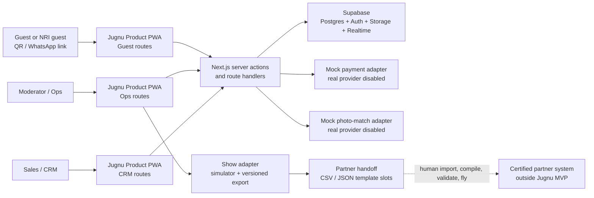

# Jugnu Pilot Product Architecture

Last updated: 2026-07-14
Status: Milestone 0 baseline; Slice 1 implementation target

## Architecture summary

Jugnu's pilot product is one mobile-first Next.js application backed by Supabase/Postgres, with
separate route groups and authorization policies for guests, moderators/ops, show exports, CRM, and
training. The existing static marketing site remains in `site/`. A root npm workspace connects both
applications to generated brand tokens and shared schemas without moving or restyling the deployed
site.



The dashed boundary is deliberate: Jugnu exports approved content; the certified partner owns show
compilation, flight validation, permissions, ground control, and flight execution.

## Runtime surfaces and routes

| Surface | Initial route family | Audience | Data boundary |
|---|---|---|---|
| Training/demo home | `/training` | Founder, demonstrator | Demo scenario and role-entry links only |
| Guest event | `/e/[eventSlug]/*` | Local and NRI guests | Published event data plus current event-scoped guest session |
| Moderation and ops | `/ops/[eventSlug]/*` | Moderator, ops lead, admin | Assigned event content, run-sheet, audits; server/RLS role checks |
| Show adapter | `/show/[eventSlug]/*` | Ops lead, show operator, admin | Approved queue, templates, export batches; never flight commands |
| CRM-lite | `/crm/*` | Sales, ops lead, admin | Inquiries, contacts, venues, proposals, bookings, activities |
| Readiness | `/api/health`, `/api/readiness` | Test/operator | No secrets; dependency status only |

## Repository boundaries

- `site/`: existing marketing application. It remains static-exported and production behavior is
  guarded by a dedicated Playwright smoke.
- `apps/product/`: all pilot application routes, server actions, provider adapters, and product UI.
- `packages/brand/`: deterministic copy/validation of `docs/brand/design-tokens.json`; no independent
  styling source.
- `packages/shared/`: domain schemas, status mappings, locale keys, route-safe types, and pure helpers.
- `supabase/migrations/`: only source of database shape/policies/functions.
- `supabase/seeds/` and `supabase/seed.sql`: deterministic, demo-only state.
- `tests/e2e/`: browser flows and stable screenshots.
- `.maestro/`: physical Android Chrome flows.

## Data model domains

### Identity and tenancy

- `organizations`: Jugnu demo organization and future tenant boundary.
- `profiles`: staff identity metadata linked to Supabase Auth; guest identity is not forced into Auth.
- `organization_members`: staff membership and organization role.
- `events`: celebration, tier, locale defaults, demo flag, publication state, time zone.
- `event_staff`: event-specific role assignment.
- `guest_sessions`: opaque event-scoped session, display name, age band, guardian linkage, locale,
  last activity. Session secrets are never stored in plaintext.
- `consent_receipts`: purpose, choice, notice version, actor/guardian, timestamp, withdrawal timestamp.

### Event participation

- `schedule_moments`: rituals, games, sky moments, meals, remote moments, backup states.
- `teams` and `team_memberships`: bride/groom/mixed/demo teams.
- `polls`, `poll_options`, `votes`: event-windowed voting with uniqueness constraints.
- `sky_messages`: guest text, language/script, price/payment reference, desired moment, current status.
- `moderation_actions`: append-only transitions with actor, reason, previous/new content and status.
- `queue_items`: approved item ordering, optimistic-lock version, assigned show slot.
- `run_sheet_items` and `run_sheet_actions`: event cue state and history.

### Show interface

- `partner_format_profiles`: versioned adapter capabilities and human handoff instructions.
- `show_templates` and `show_slots`: pre-approved formation slots and constraints.
- `show_assignments`: approved message-to-slot mapping.
- `export_batches`, `export_items`, `export_validations`: immutable versioned packages, checksum,
  validation status, handoff/acknowledgement. There is no flight-control table or API.

### Photos and privacy

- `media_items`: private storage reference, event, capture time, status, rights/source metadata.
- `upload_jobs`: resilient client upload state and checksum.
- `demo_match_profiles` and `demo_matches`: non-biometric demo fixture mapping only.
- `media_claims`: guest save/claim action.
- `data_requests`: access/correction/erasure/withdrawal workflow and audit state.
- Storage buckets remain private; signed access is event and role scoped.

### CRM-lite

- `inquiries`, `contacts`, `venues`, `planners`, `partner_operators`.
- `proposals`, `proposal_versions`, `bookings`, `crm_activities`, `follow_ups`.
- A booking can promote into an event while preserving the inquiry/proposal history.

### Cross-cutting audit

- `audit_events`: append-only security/business event record for state-changing server operations.
- High-value domains keep their own richer histories (`moderation_actions`, `run_sheet_actions`,
  proposal versions, export batches) rather than relying on one generic JSON log.

## Authorization model

| Actor | Authentication | Allowed scope |
|---|---|---|
| Unonboarded visitor | None | Published event shell and public legal text only |
| Guest/NRI guest | Signed event-scoped httpOnly session cookie | Own session, consents, messages, votes, team membership, permitted gallery objects |
| Guardian | Guest session with adult age band | Own data plus explicit consent actions for linked minor session |
| Moderator | Supabase Auth + event role | Assigned event messages/moderation queue and limited guest display metadata |
| Ops lead | Supabase Auth + event role | Assigned event run-sheet, approved queue, show exports, event configuration |
| Sales/CRM | Supabase Auth + organization role | CRM domains, no guest face/demo-match data |
| Admin | Supabase Auth + organization role | Organization configuration and assignments; still constrained by audited server paths |

RLS is enabled on every exposed domain table. Guest writes use server-side verification of the signed
event session; service-role credentials never enter client bundles. Staff policies validate both
organization membership and event assignment. Demo role switching is available only when the seeded
demo context is enabled and cannot be a hidden production fallback.

## Privacy and data minimization

- Core participation does not require a phone number, selfie, face match, exact birth date, or payment.
- Age is stored as `adult`, `minor`, or `not_provided`; the minor path links to a guardian session.
- Consent is purpose-specific and versioned. Face matching is separate, off by default, and withdrawable.
- Demo photo matching stores fixture associations, not embeddings or biometric vectors.
- Retention metadata is explicit. The proposed 90-day deletion posture is configurable and remains a
  founder/counsel gate before production.
- Payment rows contain only provider-agnostic status/reference/amount metadata. No card/bank instrument
  enters Jugnu.
- Event host reporting uses aggregate results and approved event content, not unrestricted guest PII.

## Provider adapter boundaries

```ts
interface PaymentAdapter {
  createIntent(input: PaymentIntentInput): Promise<PaymentIntentResult>;
  getStatus(reference: string): Promise<PaymentStatusResult>;
  requestRefund(reference: string, reason: string): Promise<RefundResult>;
}

interface PhotoMatchAdapter {
  createProfile(input: MatchProfileInput): Promise<MatchProfileResult>;
  findMatches(input: FindMatchesInput): Promise<PhotoMatchResult[]>;
  deleteProfile(reference: string): Promise<void>;
}

interface ShowExportAdapter {
  validate(batch: ShowExportDraft): Promise<ValidationResult[]>;
  serialize(batch: ValidatedShowExport): Promise<ExportArtifact>;
}
```

Slice 1 wires mock implementations only. Real implementations require explicit configuration and may
not silently fall back to a mock in a non-demo context.

## Offline and venue-network behavior

- Cache the published event shell, schedule, legal notice version, and already-viewed gallery
  thumbnails through normal web caching/service-worker policy.
- Queue eligible guest actions locally with idempotency keys and an honest “waiting for connection”
  state. Payment and consent state never appear final until the server confirms them.
- Compress uploads client-side; use resumable/signed upload paths and preserve retry status.
- Realtime enhances moderation and status updates but is not the only source of truth. Reconnect
  performs a server reconciliation using row versions/timestamps.
- Ops views display dependency health and last successful sync. The run-sheet has a printable/exported
  backup in a later hardening slice.

## Performance budget

Initial budgets for the guest landing/onboarding route:

- 360 px mobile-first; no horizontal scroll.
- Under 200 KB first-route application JavaScript gzip target, reviewed per slice.
- Self-hosted subset fonts; locale-specific fonts loaded only when the locale needs them.
- No hero canvas/particle field on operational product routes.
- Images use responsive sizes, modern formats, lazy loading, and upload compression.
- First useful content under 3 seconds on a simulated venue 4G profile, with measurement recorded in
  Slice 2 and the rehearsal slice.

## Test architecture

- Database: migration reset, SQL constraints, RLS positive/negative cases, deterministic seed checks.
- Unit: validators, locale mapping, state machines, export serializers/checksums.
- Playwright: browser golden flows, permission failures, responsive screenshots, accessibility and
  console/network regression.
- Maestro: physical Android Chrome critical tap/type paths via `adb reverse`.
- Contract fixtures: show exports and seeded IDs checked against golden files.
- Marketing protection: build plus Playwright smoke for `/`, `/hi`, and `/te` whenever workspace or
  shared-package changes could affect `site/`.

## Deployment and environment posture

Milestone work is local only. The Supabase project is linked, but no remote migration, seed, public
deployment, environment change, or production-data operation is implied. `.env.local` may be consumed
by local code and commands but is never printed, copied into docs, committed, or exposed to client code
except explicitly public Supabase values intended for the browser.

## Failure and recovery boundaries

- If local Supabase cannot run, record the Docker/tool blocker and keep migrations/seed statically
  testable; do not push remote as a shortcut.
- If the physical Android device disconnects, stop mobile validation and record it; Playwright mobile
  emulation does not substitute for Maestro coverage.
- If a provider is absent, use explicit demo mode with visible labeling; never fabricate success from
  a missing real provider.
- If an export is acknowledged by an operator, it becomes immutable; corrections create a new version.
- If a consent is withdrawn or erasure requested, preserve only the minimal audit evidence allowed by
  the approved policy while removing the active processing path.
